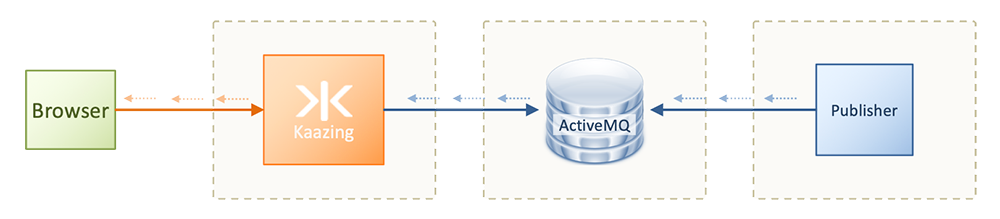

# JMS via ActiveMQ with Kaazing Gateway  

This tutorial shows how to subscribe and publish data from HTML5 clients to a JMS broker via Kaazing Gateway.

### Getting Started

To run this example:

- You must have Docker and Docker Compose installed
- You must have host file entry for `kaazing.example.com` pointing to `127.0.0.1`.

The [docker-compose.yml](docker-compose.yml) file describes the three containers it will run: the Gateway, an ActiveMQ JMS broker, and a publisher generating data.  These containers are launched in the following configuration:



The Gateway container will run a `jms` service that enables WebSocket clients to connect on the front-end.  The [Gateway config file](gateway/conf/gateway-config.xml) is configured with a `jms` service as follows:

```xml
<service>
  <name>JMS Demo Service</name>
  <description>A demo JMS service</description>
  <accept>ws://kaazing.example.com:8000/jms</accept>

  <type>jms</type>

  <properties>
    <connection.factory.name>ConnectionFactory</connection.factory.name>
    <context.lookup.topic.format>dynamicTopics/%s</context.lookup.topic.format>
    <context.lookup.queue.format>dynamicQueues/%s</context.lookup.queue.format>
    <env.java.naming.factory.initial>org.apache.activemq.jndi.ActiveMQInitialContextFactory</env.java.naming.factory.initial>
    <env.java.naming.provider.url>tcp://activemq:61616</env.java.naming.provider.url>
    <connection.security.principal>admin</connection.security.principal>
    <connection.security.credentials>admin</connection.security.credentials>
  </properties>

  <cross-site-constraint>
    <allow-origin>*</allow-origin>
  </cross-site-constraint>
</service>
```

### Run

1. Start the containers
  ```bash
  docker-compose up -d
  ```

2. Once all three containers are running, connect to the Gateway in a browser via [https://kaazing.example.com:8000/](https://kaazing.example.com:8000/).

    This is a generic JMS demo app that lets you perform different JMS operations. Ordinarily these details would be not be surfaced in an end user application, but they are exposed here to let you try different aspects of using JMS on the client.

3. Set the **Location** field to `ws://kaazing.example.com:8000/` and press **Connect**.

4. Set the **Destination** field to `/topic/stocks` and click **Subscribe**. You'll see messages streaming from the publisher, through the JMS broker and Kaazing Gateway to the client.

5. On the bottom-right of the screen, click **Unsubscribe*.

6. Change the **Destination** field to say `/topic/mytopic` and click **Subscribe**.

7. Open another tab or browser to the same URL: [https://kaazing.example.com:8000/](https://kaazing.example.com:8000/).

8. Set **Location** to `ws://kaazing.example.com:8000/jms` and hit **Connect**.

9. Change the **Destination* field to `/topic/mytopic`.

10. Put any text you want into the **Message** field and click **Send**.

11. Go back to your first browser tab and see that it received the message. It had done a round trip from the second browser tab, through Kaazing Gateway, to the JMS broker, then back through Kaazing Gateway to the first browser tab.

    If you had also subscribed to the same topic in the browser tab, you'd see the message displayed there, too, having made the same round trip.
